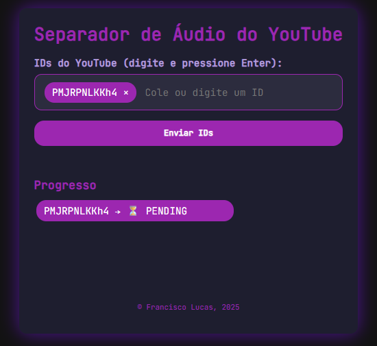
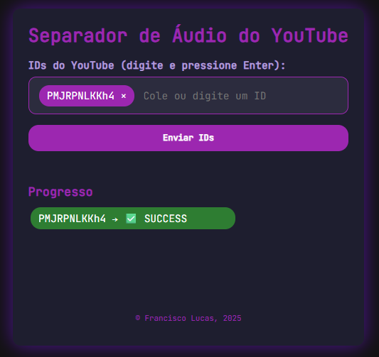

```
███████╗██╗                   ██████╗ ████████╗
██╔════╝██║                   ██╔══██╗╚══██╔══╝
█████╗  ██║         █████╗    ██████╔╝   ██║   
██╔══╝  ██║         ╚════╝    ██╔══██╗   ██║   
██║     ███████╗              ██████╔╝   ██║   
╚═╝     ╚══════╝              ╚═════╝    ╚═╝   
```

> _"FL-BT"_ stands for _"Francisco Lucas BackingTracker"_

<p align="center">
  
  
</p>

<p align="center">
  <sub><i>Initial UI design exploration assisted by AI tools</i></sub>
</p>

This project is a wrapper for the Spleeter tool. It retrieves audio from one or more YouTube videos and separates them into stems.

> Note: stems/tracks are isolated instrument tracks. Since audio data of wave formats (.wav raw/.mp3 compressed) are not made of digital signals, separating tracks of instruments/vocals is not trivial.

Each separation job of this application returns a result to the user. In short, the tool receives YouTube video IDs as _input_ and outputs zip files containing the isolated audio tracks/stems.

Originally built as a pure Python command-line script, it became useful to expose it via an HTTP web API. Using Docker, it is now suitable for various environments.

As this tool requires considerable memory and CPU, it is currently intended for localhost use only. It can run on cloud VPSs, but the target machine should have at least 12GB RAM and multiple CPU cores to handle background tasks. More implementation details are provided below.

As a local personal service, it's ideal for musicians who want to extract stems from songs without relying on paid online services. In the future, we plan to add options such as combining multiple stems into a single track, among others.

## Tech stack

The project uses mostly Python, since the Spleeter library is written in it:

- [Python 3.10](https://www.python.org/) _language*_;
- [UV](https://github.com/astral-sh/uv) (Python package manager, not pip);
- [`pytubefix`](https://github.com/JuanBindez/pytubefix) for YouTube audio downloading;
- [`spleeter`](https://github.com/deezer/spleeter) for audio stem separation;
- FastAPI as the API web server;
- Celery with Redis for background tasks;
- React + Vite to generate a simple web interface.

> _*Note_: Python 3.10 is used due to compatibility constraints. Spleeter is no longer actively released, and only works correctly with this specific version. Dependency conflicts were mostly resolved by using UV with this Python version.

## Implementation flow

Simplified flow:

- Task submitted via API:
  - `POST /api/submit/{ID}` — receives the YouTube video ID in path param;
  - responds with a `TASK_ID`;
- Task is enqueued using Celery;
- Client can poll for task status:
  - `GET /api/status/{TASK_ID}`;
- When complete, result files are stored temporarily:
  - files are deleted after download;
  - cleanup worker planned for the future;
  - currently stored locally, but may move to CDN later;
- Client can:
  - `GET /api/download/{TASK_ID}` to download the result;
- Multiple requests are allowed:
  - API is `asynchronous`;
  - background worker is `synchronous` (single job at a time).

## How to use

This project runs with Docker. If Docker is available on your machine:

- Clone or download this repository;
- Navigate to the folder in terminal;
- Run:
```shell
docker-compose up --build
````

For later runs, omit the `--build` flag.

After startup, access the web interface at `http://localhost:8000/app`.

You can also use the API via terminal with curl or any HTTP client:

* `POST /api/submit/{youtube_video_id}`

  * responds with a `task ID`;
  * example: `curl -X POST http://localhost:8000/api/submit/vjVkXlxsO8Q`
  * response: `{"task_id":"9332b4ce-bb5b-4ecf-9457-e14581486223","status":"PENDING","error":null}`
* `GET /api/status/{task_id}`

  * example: `curl http://localhost:8000/api/status/9332b4ce-bb5b-4ecf-9457-e14581486223`
  * response: `{"task_id":"9332b4ce-bb5b-4ecf-9457-e14581486223","status":"SUCCESS","error":null}`
* `GET /api/download/{task_id}`

  * TODO: add usage examples

If you don't want to deal with curl endpointing, the web UI page at `/app` handles then for you.

> Note 1: Spleeter uses FFMPEG and pretrained model binaries, so container size is large.

> Note 2: Due to heavy dependencies, container build takes time.

> Note 3: You may face low-memory issues depending on your machine.

> Note 4: On my machine, Docker takes around 500 seconds to build the container.

## Project structure

From project root:

* `Dockerfile`, `docker-compose.yaml`, `pyproject.toml`, `uv.lock`

  * required files to build and run the container;
* `/server`

  * Python source code;
* `/web_client`

  * React + Vite project to generate a static web page.

## Known issues

Due to memory usage and processing intensity, you may face:

* Worker task crash in container:

  * likely due to memory leaks — Spleeter (via TensorFlow/Keras) may not release memory or dispose C++ tensors properly between tasks;
  * workaround: keep Celery queue small (max 2 jobs); if one fails, restart container and re-submit the task;
* Long YouTube videos can crash the worker due to memory exhaustion.

## Contributing

This is a personal-use project, but it's also a good learning opportunity. I'm likely to miss best practices in some areas, so any contribution or feedback is welcome.